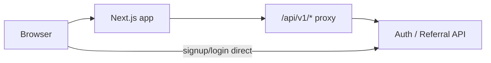

# Doublle Referral — Product Understanding (Agent Navigation)

**Purpose:** Fast orientation for AI agents and engineers. Use this doc to jump to the right files instead of scanning the whole repo.

**Full product spec:** [`docs/Doublle_Referral_Module_PRD.md`](./Doublle_Referral_Module_PRD.md) (business rules, flows, admin, compliance).

**Repo role:** Next.js 16 **frontend shell** for the in-app referral module. Business logic, persistence, commissions, and fraud live on the **auth/referral API** (`AUTH_API_BASE_URL`). This app renders UI, proxies authenticated API calls, and implements signup attribution + cookie behavior per PRD.

---

## 1. MVP product rules (condensed)

| Topic | Rule |
| --- | --- |
| Who can refer | Logged-in Doublle users only (MVP) |
| Default program | 5% of referee **net revenue** for **12 months** |
| Net revenue | Gross paid invoice − refunds − chargebacks − taxes − pass-throughs |
| Attribution | 30-day first-party cookie; **manual code at signup overrides** cookie/link |
| One referee → one referrer | No multi-level referrals |
| Commission states | `pending` → `earned` → `paid` (+ `clawedBack`) |
| Hold | 30 days after invoice payment before earned |
| Payout (MVP) | Account **credit** only (not cash) |
| Terms | Must accept versioned program terms before link/code is active |
| Phase 2 (out of scope unless asked) | Cash payouts, partner programs, public influencer codes |

---

## 2. System shape

- **Authenticated reads/writes:** Browser calls same-origin `/api/v1/...` → `src/app/api/v1/[...path]/route.ts` → `src/lib/auth/upstream-proxy.ts` (forwards cookie as Bearer).
- **Signup / sign-in:** Client posts directly to `{AUTH_API_BASE_URL}/api/v1/auth/signup-referral` and `signin-referral` (see `src/lib/referrals/referral-auth-client.ts`).
- **Referrer dashboard:** Client-side load in `src/app/referal/referral-dashboard.tsx` (not SSR today).

---

## 3. Routes (pages)

| Path | File | What it does |
| --- | --- | --- |
| `/` | `src/app/page.tsx` | Redirects authed users to `/referal`; unauthed → login or signup with `?ref=` |
| `/login` | `src/app/login/page.tsx`, `login-form.tsx` | Sign-in; `returnTo` defaults to referral home |
| `/signup` | `src/app/signup/page.tsx`, `signup-form.tsx` | Referee signup; referral code field, validation, attribution |
| `/referal` | `src/app/referal/page.tsx`, `referral-dashboard.tsx` | **Primary product surface** — referrer dashboard |
| `/billing` | `src/app/billing/page.tsx` | Subscribe / plans (Razorpay when enabled) |
| `/dashboard` | `src/app/dashboard/page.tsx`, `workspace-dashboard.tsx` | Workspace placeholder |
| `/admin` | `src/app/admin/page.tsx` | Operator table — **stub** (empty rows until API wired) |

**Auth routing:** `src/middleware.ts` + `src/lib/auth/cookie.ts`  
- Cookie name: `doublle_access_token` (override via `NEXT_PUBLIC_AUTH_TOKEN_COOKIE_NAME`)  
- Post-login home: `/referal` (`REFERRAL_HOME`)  
- Referral cookie: `doublle-active-referral-code` (30 days) — `src/lib/referrals/referral-cookies.ts`

**Note:** Route spelling is `/referal` (not `referral`).

---

## 4. Task → file index (start here)

Use this table to open only what you need.

### Referrer dashboard (share link, stats, referees, commissions)

| Task | Go to |
| --- | --- |
| Page entry + loading | `src/app/referal/page.tsx`, `loading.tsx` |
| Client orchestration (load, terms accept, errors) | `src/app/referal/referral-dashboard.tsx` |
| Layout / terms gate / sections | `src/components/referrals/dashboard-shell.tsx` |
| Hero (link, code, share) | `src/components/referrals/hero-card.tsx`, `share-button.tsx`, `copy-button.tsx`, `copyable-field.tsx` |
| KPI strip | `src/components/referrals/stats-strip.tsx` |
| Referees table + detail sheet | `src/components/referrals/referees-table.tsx`, `referee-commission-sheet.tsx` |
| Commission history panel | `src/components/referrals/transactions-panel.tsx` |
| Terms accept modal / view modal | `src/components/referrals/program-terms-modal.tsx`, `program-terms-view-modal.tsx`, `program-terms-modal-host.tsx` |
| Commission state badges | `src/components/referrals/state-badge.tsx` |
| API client (browser) | `src/lib/referrals/referral-api-client.ts` |
| Build UI model from API | `src/lib/referrals/build-referrer-dashboard.ts` |
| Parse dashboard JSON | `src/lib/referrals/referral-dashboard-payload.ts` |
| Parse `/me`, program, terms | `src/lib/referrals/referral-payload.ts` |
| Parse transactions JSON | `src/lib/referrals/referral-transactions-payload.ts` |
| Share URL helpers | `src/lib/referrals/referral-share-url.ts` |
| Server action: accept terms | `src/app/referal/actions.ts` |
| Server-side fetch (optional) | `src/lib/referrals/fetch-referral-dashboard.ts`, `get-referrer-dashboard.ts` |
| Domain types | `src/lib/referrals/types.ts` |
| Formatting (money, dates) | `src/lib/referrals/format.ts` |

### Signup / referee attribution

| Task | Go to |
| --- | --- |
| Signup page + cookie read | `src/app/signup/page.tsx` |
| Signup form UI + API submit | `src/app/signup/signup-form.tsx` |
| LINK vs CODE + override rule | `src/lib/referrals/signup-attribution.ts` |
| Validate code (live check) | `src/lib/referrals/fetch-validate-referral-code.ts`, `validate-referral-code.ts`, `referral-api-client.ts` (`fetchValidateReferralCodeClient`) |
| Signup plans catalog | `src/lib/referrals/fetch-signup-plans.ts` |
| Set cookie from `?ref=` | `src/middleware.ts` |

### Auth & session

| Task | Go to |
| --- | --- |
| Login UI | `src/app/login/login-form.tsx`, `page.tsx` |
| API base URL resolution | `src/lib/auth/api-base.ts` |
| Cookie / path guards | `src/lib/auth/cookie.ts`, `middleware.ts` |
| Proxy to upstream | `src/lib/auth/upstream-proxy.ts`, `src/app/api/v1/[...path]/route.ts` |
| Session route | `src/app/api/auth/session/route.ts` |
| Logout | `src/lib/auth/logout.ts`, `src/app/api/auth/logout/route.ts` |
| Client bearer from cookie | `src/lib/referrals/auth-token.ts` |
| Server referral headers | `src/lib/referrals/auth-api.ts` |

### Billing (referee convert / subscribe)

| Task | Go to |
| --- | --- |
| Billing page | `src/app/billing/page.tsx` |
| Plans UI | `src/components/billing/subscribe-plans-panel.tsx` |
| Env / pricing display | `src/lib/billing/payments-config.ts` |
| Create subscription | `src/lib/billing/create-subscription.ts` |
| Razorpay types | `src/types/razorpay.d.ts`, `src/lib/billing/razorpay.ts` |
| Poll after checkout | `src/lib/billing/poll-subscription.ts` |
| Subscriptions API parse | `src/lib/referrals/billing-payload.ts`, `fetch-billing-subscriptions.ts` |

### Admin / operator (MVP stub in this repo)

| Task | Go to |
| --- | --- |
| Admin page | `src/app/admin/page.tsx` |
| Table component | `src/components/referrals/admin-referrals-table.tsx` |
| Data loader (returns `[]` today) | `src/lib/referrals/get-admin-referrals.ts` |

### Shell / shared UI

| Task | Go to |
| --- | --- |
| App chrome / nav | `src/components/workspace/workspace-app-shell.tsx` |
| Referral login marketing shell | `src/components/referrals/login-shell.tsx` |
| Empty / error states | `src/components/referrals/mock-server-state.tsx` |
| Skeletons | `src/components/referrals/skeleton.tsx` |
| Icons | `src/components/referrals/icons.tsx` |
| Global styles | `src/app/globals.css`, `src/app/layout.tsx` |

### Ops / deploy

| Task | Go to |
| --- | --- |
| Vercel cron → upstream health | `vercel.json`, `src/app/api/health/route.ts` |
| Next config | `next.config.ts` |

---

## 5. Upstream API surface (this app consumes)

All paths are under `{AUTH_API_BASE_URL}/api/v1/...` unless noted.

| Method | Path | Used by |
| --- | --- | --- |
| POST | `/auth/signup-referral` | Signup form (direct) |
| POST | `/auth/signin-referral` | Login form (direct) |
| GET | `/referral/program` | Program terms + parameters |
| GET | `/referral/me` | Enrollment, terms acceptance, code |
| GET | `/referral/me/dashboard` | Stats, referees, commission summary |
| GET | `/referral/me/transactions` | Commission ledger UI |
| POST | `/referral/terms/accept` | Terms gate (server action + client) |
| POST | `/referral/code/validate` | Signup code validation |
| GET | `/signup/plans` or `/catalog/plans` | Signup plan picker |
| GET | `/billing/subscriptions/me` | Billing / benefit context |
| POST | `/billing/subscriptions` | Razorpay checkout |
| GET | `/health` | Cron probe via `src/app/api/health/route.ts` |

**Browser pattern:** `referral-api-client.ts` uses `/api/v1/...` on the app origin so HttpOnly cookies work through the proxy.

---

## 6. Key user flows (which files chain together)

### A. Visitor lands with `?ref=CODE`

1. `middleware.ts` — `/?ref=` → redirect `/signup?ref=` + set `doublle-active-referral-code`
2. `signup/page.tsx` — read cookie into form default
3. `signup-attribution.ts` — classify LINK vs CODE; manual edit → CODE wins
4. `signup-form.tsx` — POST signup-referral with attribution payload

### B. Referrer opens dashboard

1. `referal/page.tsx` → `referral-dashboard.tsx`
2. `referral-api-client.ts` — `loadReferralDashboardClient()` (program + me + dashboard [+ transactions])
3. `build-referrer-dashboard.ts` + payload mappers → `ReferrerDashboardData`
4. If terms not accepted → `dashboard-shell.tsx` + `program-terms-modal.tsx`
5. Accept → `actions.ts` or client `acceptReferralTermsClient` → reload

### C. Commission display

- API commission records → `referral-transactions-payload.ts` → `TransactionData` / `RefereeData.commissions`
- UI states map via `mapCommissionState` (align with PRD pending/earned/paid/clawed back)

---

## 7. Domain types (UI contract)

Defined in `src/lib/referrals/types.ts`:

- `CommissionState`: `"pending" | "earned" | "paid" | "clawedBack"`
- `ReferrerDashboardData`: `hero`, `stats`, `referees`, `transactions`, `programTerms`, `termsAcceptance`, flags
- `RefereeData`, `TransactionData`, `ProgramTermsData`, `SessionUser`
- Query error enums for login and terms redirects

When changing API shapes, update **payload parsers first** (`referral-payload.ts`, `referral-dashboard-payload.ts`, `referral-transactions-payload.ts`), then `build-referrer-dashboard.ts`, then components.

---

## 8. Environment variables

| Variable | Role |
| --- | --- |
| `NEXT_PUBLIC_AUTH_API_BASE_URL` | Auth/referral API origin (required for real data) |
| `AUTH_API_BASE_URL` | Server-only override (SSR, server actions, health cron) |
| `NEXT_PUBLIC_AUTH_TOKEN_COOKIE_NAME` | Session cookie name (default `doublle_access_token`) |
| `NEXT_PUBLIC_PAYMENTS_ENABLED` | Toggle billing / Razorpay UI |
| `NEXT_PUBLIC_BILLING_*` | Display pricing / currency in subscribe panel |

If `NEXT_PUBLIC_AUTH_API_BASE_URL` is unset, referral dashboard shows **misconfigured** state (`mock-server-state.tsx` pattern via `referral-dashboard.tsx`).

---

## 9. Implementation status in this repo

| Area | Status |
| --- | --- |
| Referrer dashboard UI | Implemented (client-fetched) |
| Terms acceptance flow | Implemented (API + redirect errors) |
| Signup with referral code + cookie | Implemented |
| Code validation at signup | Implemented |
| API proxy + session forwarding | Implemented |
| Billing / subscribe UI | Implemented (feature-flagged) |
| Admin referrals table | **Stub** — `get-admin-referrals.ts` returns `[]` |
| Server-rendered referral dashboard | Loader exists but page uses client path |
| Fraud queue / program editor | **Not in this repo** — backend + future admin UI |
| Transactional email | **Not in this repo** — backend |

---

## 10. Conventions agents should follow

1. **PRD wins** for business rules; this doc wins for **where code lives**.
2. **Minimal diffs** — extend existing payload mappers and `referral-api-client.ts` before adding parallel fetch logic.
3. **Next.js 16** — check `node_modules/next/dist/docs/` if using framework APIs (see `AGENTS.md`).
4. **Do not rename** `/referal` without coordinated routing/middleware updates.
5. **Phase 2** features (cash payout, influencer codes, partners) — only if explicitly requested.

---

## 11. Quick grep anchors

| Looking for… | Search |
| --- | --- |
| API path strings | `/api/v1/referral` |
| Cookie name | `doublle-active-referral-code` |
| Attribution override | `resolveSignupReferralSource` |
| Dashboard load entry | `loadReferralDashboardClient` |
| Commission state mapping | `mapCommissionState` |
| Terms accept | `acceptReferralTerms` |

---

## 12. Related files outside `src/`

| File | Role |
| --- | --- |
| `AGENTS.md` | Agent rules + pointer to this doc and PRD |
| `docs/Doublle_Referral_Module_PRD.md` | Full product requirements |
| `package.json` | Next 16.2, React 19, Tailwind 4 |

---

*Last aligned with repo structure: May 2026. Update section 4 when adding new routes or major modules.*
